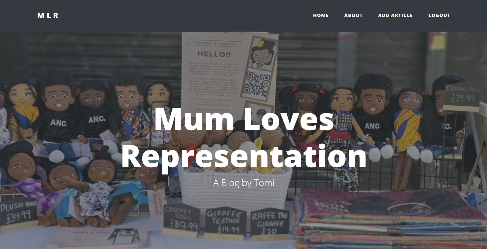
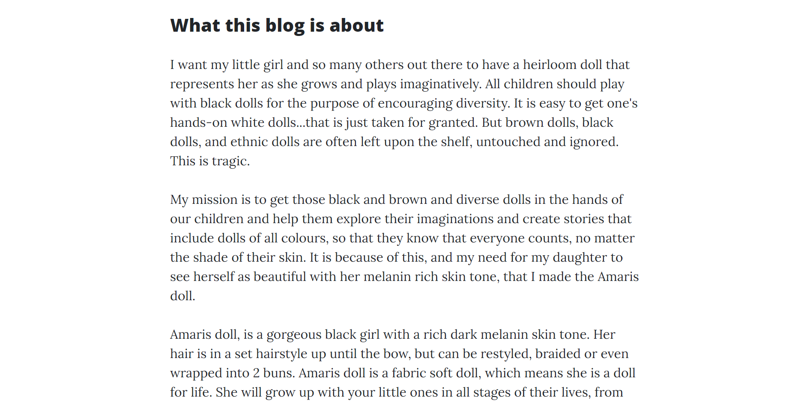
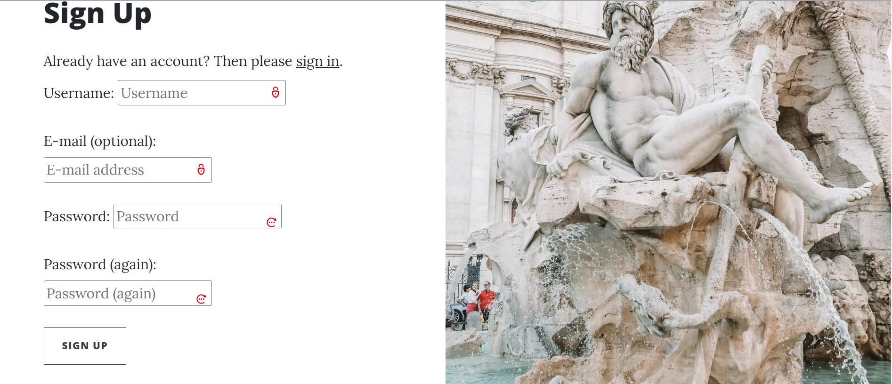

# Mum Loves Representation
Mum Loves Representation is a blog by an African British Mum(Tomi) who wants her little girl to be able to play with a heirloom doll that represents her as she grows and plays imaginatively. She believes that all children should play with black dolls for the purpose of encouraging diversity. She feels that  brown dolls, black dolls, and ethnic dolls are often left upon the shelf, untouched and ignored while it is easy to get one's hands-on white dolls. She believes the situation is very tragic.This blog features several Articles posted by Tomi that shed more light on this issue along with several other topics under the ethnicity topic.

The Responsive Mockup image above shows how responsive the Mum Loves Representation is across various device screen sizes ranging from mobile devices to large monitor screens. The Mum Loves Representation is well layed out with a bold font style used across all pages. The buttons are very legible on all the screen sizes. 

## UX

### Colour Scheme Used
I chose to go with this Boostrap blog theme called Clean Blog. It features a modern design with a subtle splash of color. This makes the site very easy to read with large fonts that are well spaced out. I made use of specifically choosen background images to showcase the theme of the blog. 

### Typography

I chose to use this carefully styled Bootstrap blog theme which features distraction free blog text optimized for legibility. It uses the Lora font-family for the body and the Open Sans font-family for the headers.

## Features 

### Existing Features

- __The home page__

  - The home page contains the page header which features a specifically choosen background image that showcases various kinds of dolls in question. It contains the name of the blog and author as the hero text. Under the page header you have the article list area that shows the tiltle of the article, an excerpt, author, date created and a like button.
 

- __Navigation Bar__

  - It is made up of five links including the logo. They are the Home page, About page, Add Article page and the Logout page(this changes to the register page and login page when there is no user logged in). It is fully responsive and features on all the pages. The Logo also links back to the home page. 
  - It makes it very easy for users to navigate around the pages with multiple links back to the home page.  

  __About Page__

  - The about page contains the page header which features a specifically choosen background image. It contains the name of the blog and author as the hero text. 
  - Under the page header you have the about page content with a header and the content.

  

    __Register Page__

  - It contains input fields for signing up.
  - It has a sign up button that has a hoover effect

  

- __The Footer__

  - At the very bottom of the home page and every other page on the MLR website is the footer which houses the relevant social media links. 
  -  When clicked on, these social media links open to a new tab preventing the user from having to use the back button to go back to the page they were on before.

### Features Left to Implement

- A Contact form to collect user info.
- A category field to allow user categorize articles into various types. 

## Technologies Used

- I used HTML to design the templates.
- I used a Bootstrap theme that came with its css files and custom javascripts.
- I used Javascript to set date in footer automatically.
- I used Django frame work to create the website
- I used Gitpod as my code editor to write all the codes used throughout the website.
- I used Github to host my repositories.
- I used Git for version control of my website.
- I used Heroku to deploy the website.

## Testing 

- .  

### Validator Testing 

## Deployment

The app was deployed to Heroku. There are four stages:
     Create the Heroku app,
     Attach the database,
     Prepare our environment and settings.py file,
     Get our static and media files stored on Cloudinary.

- Create the Heroku app:
    

The live link can be found here - https:///

### Local Deployment

To make a local copy of this project, you can clone it by typing the following in your IDE terminal:

- `git clone https://github.com/onabz/MAR_Blog.git`

Alternatively, if using Gitpod, you can click the green Gitpod button, or use [this link](https://gitpod.io/#https://github.com/onabz/MAR_Blog)

## Credits 
 
### Content 

- 

### Media

-

### Acknowledgements
- I would like to thank [Student Care](https://learn.codeinstitute.net/ci_support/diplomainsoftwaredevelopmentecommerce/studentcare) for their regular check up on me to ensure that I was always on track to completing this project and to reassure me that they were always available if I needed any help.