# Mum Loves Representation
Mum Loves Representation is a blog by an African British Mum(Tomi) who wants her little girl to be able to play with a heirloom doll that represents her as she grows and plays imaginatively. She believes that all children should play with black dolls for the purpose of encouraging diversity. She feels that  brown dolls, black dolls, and ethnic dolls are often left upon the shelf, untouched and ignored while it is easy to get one's hands-on white dolls. She believes the situation is very tragic.This blog features several Articles posted by Tomi that shed more light on this issue along with several other topics under the ethnicity topic.

The Responsive Mockup image above shows how responsive the Mum Loves Representation is across various device screen sizes ranging from mobile devices to large monitor screens. The Mum Loves Representation is well layed out with a bold font style used across all pages. The buttons are very legible on all the screen sizes. 

## UX

### User Stories:
- As a User I can view a list of all articles so that I can choose one to read.
- As a User I can click on an article so that I can read it in full.
- As a User I can like or unlike articles so that I can express my views about them.
- As a User I can view number of likes on each article so that I can see those that are more popular.
- As a User I can leave comments on an article so that I can interact with the content creator.
- As a User I can view comments on articles so that I can see the reader's thoughts on the article.
- As a User/Admin I can approve or disapprove comments so that I can filter out questionable comments.
- As a User I can register an account so that I can like and comment on an article.
- As a User/Admin I can create, read, update and delete posts so that I can manage my articles.
- As a User/Admin I can draft an article so that I can work on it later.
- As a Site User I can add an article from within the website so that I don't have to use the admin panel.
- As a Site User I can edit an article from within the website so that I don't have to use the admin panel.
- As a Site User I can delete an article from within the website so that I don't have to use the admin panel.
- As a Site Admin I can authorise a user so that they can edit/delete an article.

### Colour Scheme Used
I chose to go with this Boostrap blog theme called Clean Blog. It features a modern design with a subtle splash of color. This makes the site very easy to read with large fonts that are well spaced out. I made use of specifically choosen background images to showcase the theme of the blog. 

### Typography

I chose to use this carefully styled Bootstrap blog theme which features distraction free blog text optimized for legibility. It uses the Lora font-family for the body and the Open Sans font-family for the headers.

### Wireframes

Below are sketched images of how I planned to layout the website design. You will notice that the final design of the website is slightly different from my initial sketches for some pages which is because the template i used was not an exact match to my sketches.

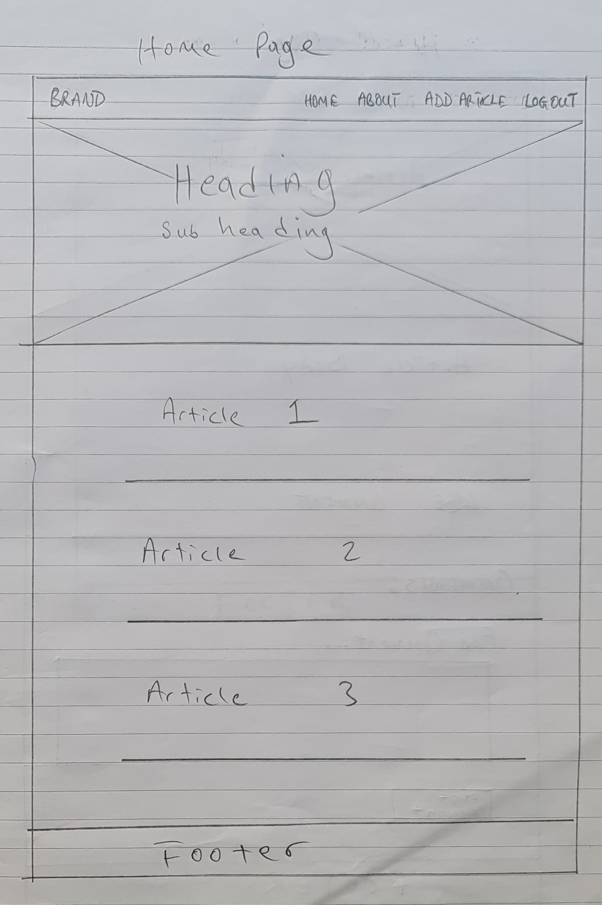
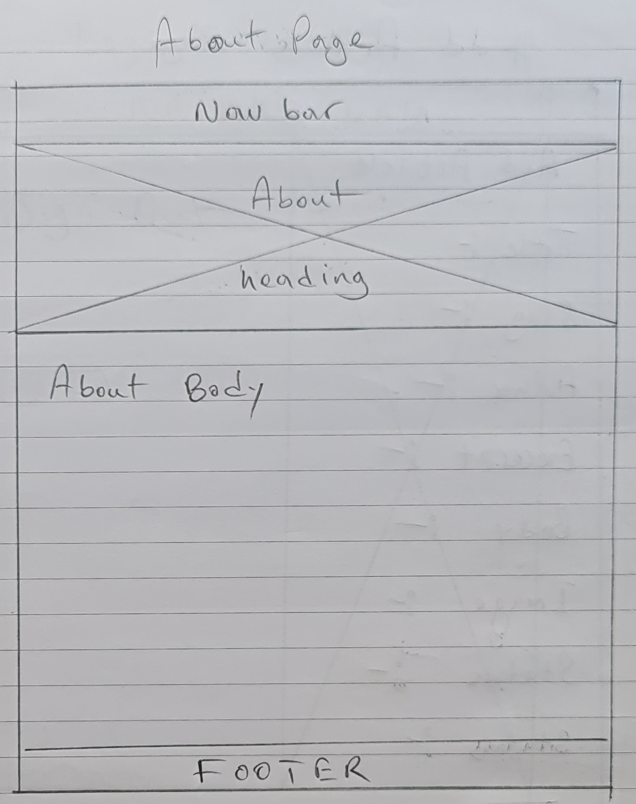
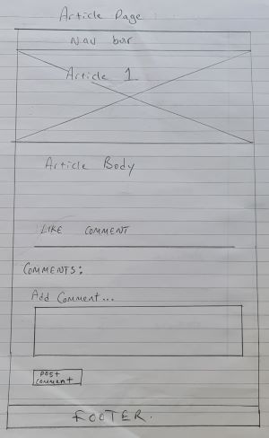
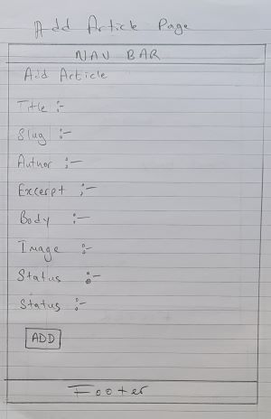
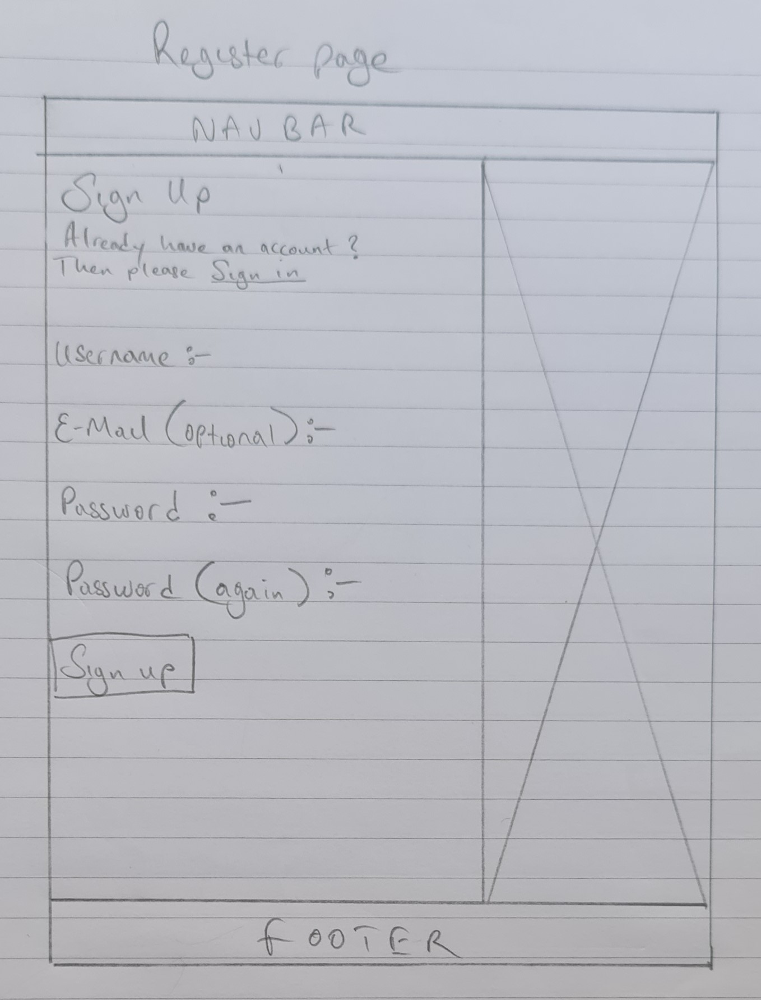
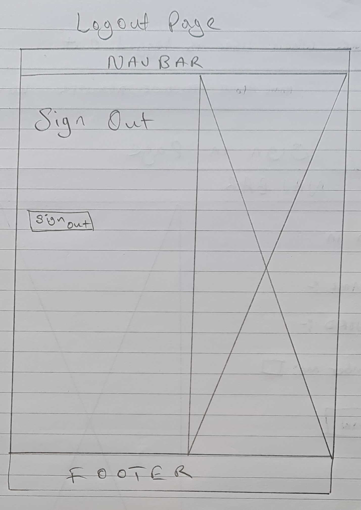
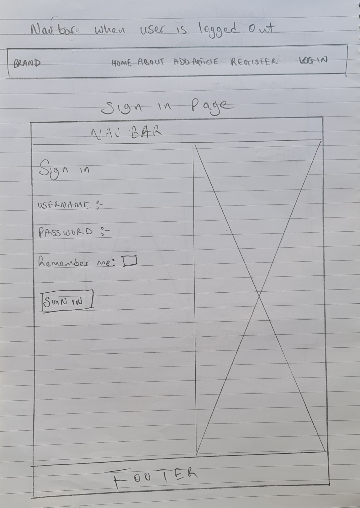

## Features 

### Existing Features:

  __The home page__

  - The home page contains the page header which features a specifically choosen background image that showcases various kinds of dolls in question. It contains the name of the blog and author as the hero text. Under the page header you have the article list area that shows the tiltle of the article, an excerpt, author, date created and a like button.
 

 __Navigation Bar__

  - It is made up of five links including the logo. They are the Home page, About page, Add Article page and the Logout page(this changes to the register page and login page when there is no user logged in). It is fully responsive and features on all the pages. The Logo also links back to the home page. 
  - It makes it very easy for users to navigate around the pages with multiple links back to the home page.  

  __About Page__

  - The about page contains the page header which features a specifically choosen background image. It contains the name of the blog and author as the hero text. 
  - Under the page header you have the about page content with a header and the content.

  

  __Article Page__

  - This page shows each article in detail.

  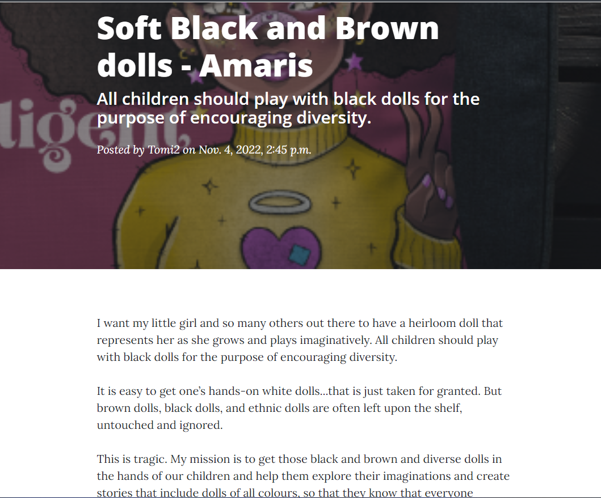

  - It shows details about the title,excerpt,author and date the article was created. 
  - It gives users the ability to like and unlike the article with a like button below the article.

  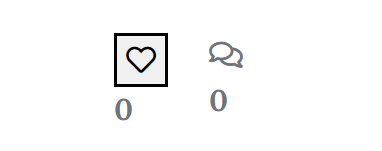

  - It also gives users the ability to comment on articles with a comment section below the articles.

  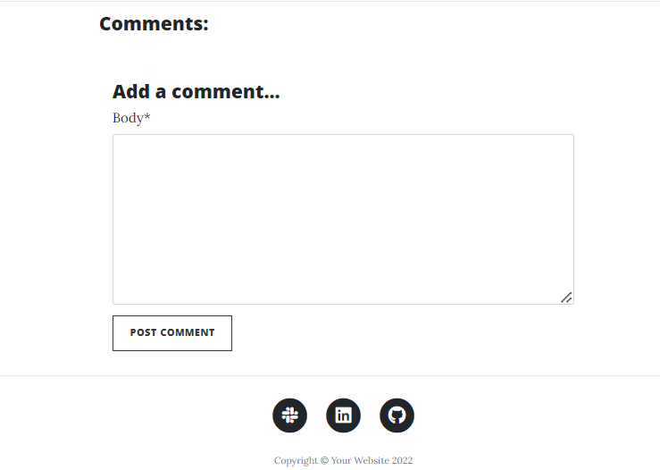

  - When non superusers post comments, they do not appear immediately on the article page. Instead the request is sent to the admin for approval. Once approved it then appears below the article. This gives the admin the ability to filter out unwanted comments. 

  __Article edit/delete feature__

  - Under the article list section on the home page, a user can edit or delete an article that the user is authorised to.
  - The edit or delete feature won't appear on articles the user is not authorised to modify.

  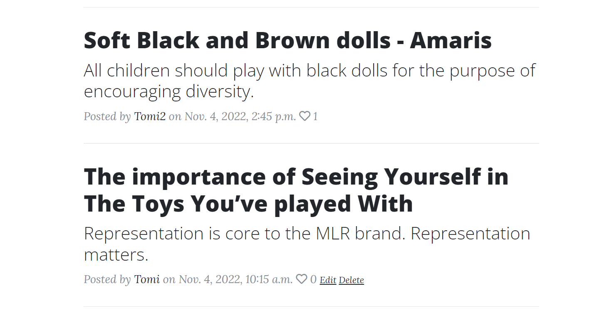

  - A user who is not logged in cannot edit or delete any article.

  

  __Add Article Page__

  - This is the page from which authorised users and admin can add new articles to the blog.
  - A user needs to be logged in to use this page. If a user is not logged in, they get a warning page telling them to login.

  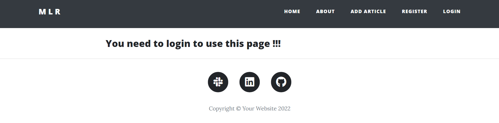

  - This page contains the relevant input fields for for adding a new article.

  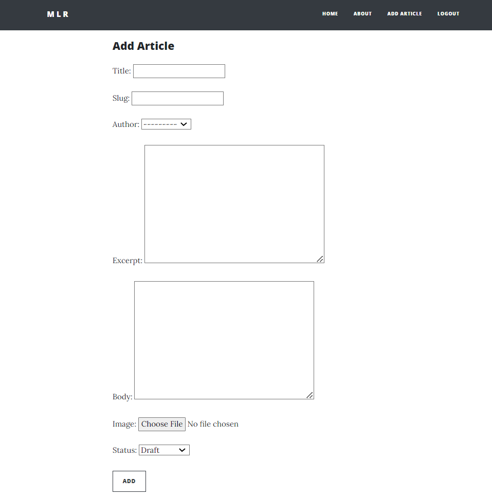

  __Update Article Page__

  - This page allows authorised users to edit articles that they have posted.
  - It gives them relevant prepopulated input fields to carryout editing.
  - It has an update button to post the updated article.

  __Delete Article Page__

  __Register Page__

  - It contains input fields for signing up.
  - It has a sign up button that has a hoover effect.
  - It has a background image to the right side of the input fields which further showcases the brand.

  

  __Login Page__

  - It contains input fields for user login. 
  - It has a sign in button that has a hoover effect.
  - It has a background image to the right side of the input fields which further showcases the brand.

  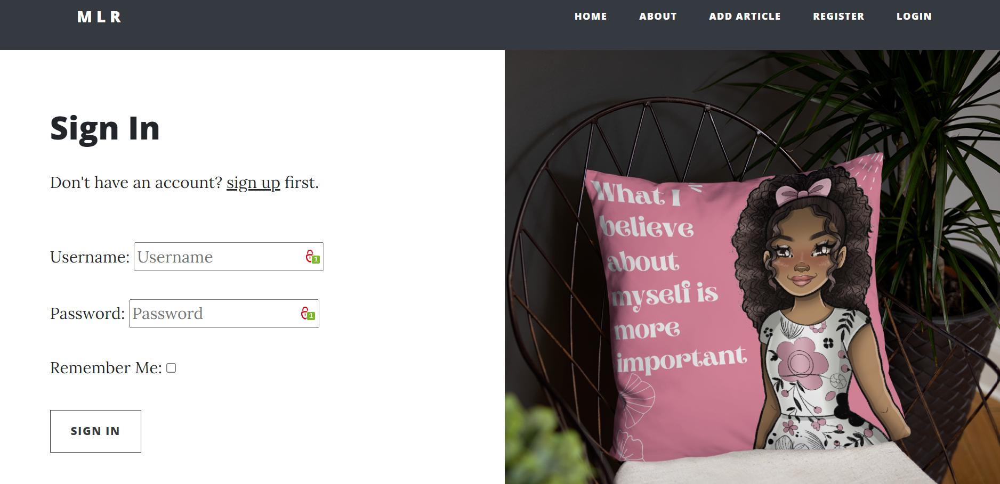

  __Logout Page__

  - It contains a sign out button for a user to logout. 
  - The sign out button that has a hoover effect.
  - It has a background image to the right side of the input fields which further showcases the brand.

  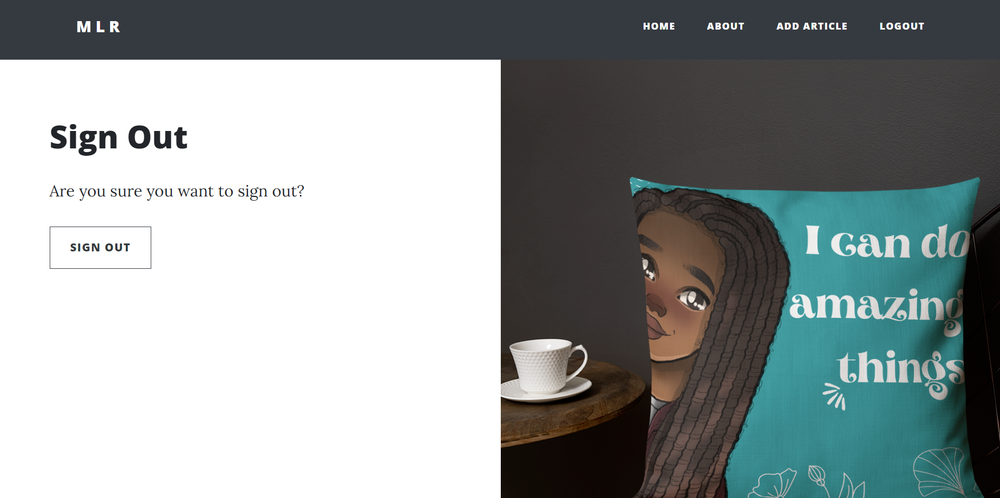
 

 __The Footer__

  - At the very bottom of the home page and every other page on the MLR website is the footer which houses the relevant social media links. 
  -  When clicked on, these social media links open to a new tab preventing the user from having to use the back button to go back to the page they were on before.

### Features Left to Implement

- A Contact form to collect user info.
- A category field to allow user categorize articles into various types. 

## Technologies Used

- I used HTML, CSS and Javascript to design the templates.
- I used a Bootstrap theme that came with its css files and custom javascripts.
- I used Javascript to set date in footer automatically.
- I used Django frame work to create the website.
- I used Python to input commands in Django frame work.
- I used Gitpod as my IDE for this project.
- I used Github to host my repositories.
- I used Git for version control of my website.
- I used Google Chrome DevTools for testing the application's functionality.
- I used Font Awesome icon for the social media icons.
- I used Heroku to deploy the website.

## Database

## Testing 

- HTML

- CSS
  - No errors were found when passing through the [W3C CSS Validator](https://validator.w3.org/nu/#textarea)

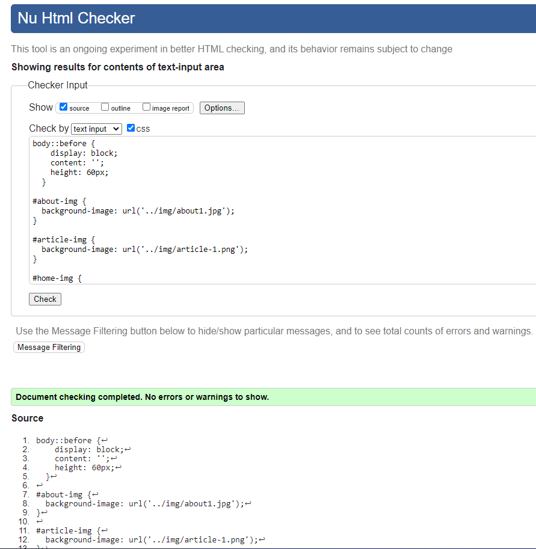

### Validator Testing 

## Deployment

The app was deployed to Heroku. There are four stages:
     Create the Heroku app,
     Attach the database,
     Prepare our environment and settings.py file,
     Get our static and media files stored on Cloudinary.

- Create the Heroku app:
    - In Heroku.com create new Heroku App - APP_NAME, Location = Europe.
    - Add Database to App Resources - Located in the Resources Tab, Add-ons, search and add e.g. 'Heroku Postgres'.
    - Copy DATABASE_URL value - Located in the Settings Tab, click reveal Config Vars, Copy Text.
   
- Attach the Database:
    - In gitpod:
      - Create new env.py file on top level directory - E.g. env.py

    - In env.py:
      - Import os library - import os
      - Set environment variables - os.environ["DATABASE_URL"] = "Paste in Heroku DATABASE_URL Link"
      - Add in secret key - os.environ["SECRET_KEY"] = "Make up your own randomSecretKey"

    - In heroku.com:
      - Add Secret Key to Config Vars - SECRET_KEY, "randomSecretKey"

- Prepare our environment and settings.py file:
    - In settings.py:
      - Reference env.py -  
                            
                            from pathlib import Path
                            import os
                            import dj_database_url

                            if os.path.isfile("env.py"):
                              import env
      - Remove the insecure secret key and replace - links to the SECRET_KEY variable on Heroku - SECRET_KEY = os.environ.get('SECRET_KEY')
      - Comment out the old DataBases Section - 

                                                  # DATABASES = {
                                                  #     'default': {
                                                  #         'ENGINE': 'django.db.backends.sqlite3',
                                                  #         'NAME': BASE_DIR / 'db.sqlite3',
                                                  #     }
                                                  # }
      - Add new DATABASES Section ( - links to the DATATBASE_URL variable on Heroku) - 

              DATABASES = {
                  'default': dj_database_url.parse(os.environ.get("DATABASE_URL"))
              }
    - In the Terminal:
      - Save all files and Make Migrations - python3 manage.py migrate
  
  - Get our static and media files stored on Cloudinary:
    - In Cloudinary.com:
      - Copy your CLOUDINARY_URL e.g. API Environment Variable - From Cloudinary Dashboard
    - In env.py:
     - Add Cloudinary URL to env.py - be sure to paste in the correct section of the link - os.environ["CLOUDINARY_URL"] = "cloudinary://************************"
    - In Heroku:
      - Add DISABLE_COLLECTSTATIC to Heroku Config Vars (temporary step for the moment, will be removed before deployment - e.g. DISABLE_COLLECTSTATIC, 1
    - In settings.py:
      - Add Cloudinary Libraries to installed apps - 
                                                    
                                                    INSTALLED_APPS = [
                                                                        …,
                                                                        'cloudinary_storage',
                                                                        'django.contrib.staticfiles',
                                                                        'cloudinary',
                                                                        …,
                                                    ]

                                                    (note: order is important)
      - Tell Django to use Cloudinary to store media and static files (Place under the Static files) - 

              STATIC_URL = '/static/'

              STATICFILES_STORAGE = 'cloudinary_storage.storage.StaticHashedCloudinaryStorage'
              STATICFILES_DIRS = [os.path.join(BASE_DIR, 'static')]
              STATIC_ROOT = os.path.join(BASE_DIR, 'staticfiles')

              MEDIA_URL = '/media/'
              DEFAULT_FILE_STORAGE = 'cloudinary_storage.storage.MediaCloudinaryStorage'
      - Link file to the templates directory in Heroku (Place under the BASE_DIR line) - 

                                  TEMPLATES_DIR = os.path.join(BASE_DIR, 'templates')
      - Change the templates directory to TEMPLATES_DIR (Place within the TEMPLATES array) - 

              TEMPLATES = [
                {
                  …,
                  'DIRS': [TEMPLATES_DIR],
                  …,
                    ],
                  },
                },
              ]
      - Add Heroku Hostname to ALLOWED_HOSTS - ALLOWED_HOSTS = ['marblog.herokuapp.com', 'localhost']
    - In Gitpod:
      - Create 3 new folders on top level directory - media, static, templates
      - Create procfile on the top level directory - Procfile
    - In Procfile:
      - Add code - web: gunicorn marblog.wsgi
    - Note: Save all files
    -  In the Terminal:
      - Add, Commit and Push - 

                                git add .
                                git commit -m "Deployment Commit"
                                git push
    - In Heroku:
      - Deploy Content manually through heroku.

The live link can be found here - https:///

### Local Deployment

To make a local copy of this project, you can clone it by typing the following in your IDE terminal:

- `git clone https://github.com/onabz/MAR_Blog.git`

Alternatively, if using Gitpod, you can click the green Gitpod button, or use [this link](https://gitpod.io/#https://github.com/onabz/MAR_Blog)

## Credits 
 
### Content 

- 

### Media

-

### Acknowledgements
- I would like to thank [Student Care](https://learn.codeinstitute.net/ci_support/diplomainsoftwaredevelopmentecommerce/studentcare) for their regular check up on me to ensure that I was always on track to completing this project and to reassure me that they were always available if I needed any help.